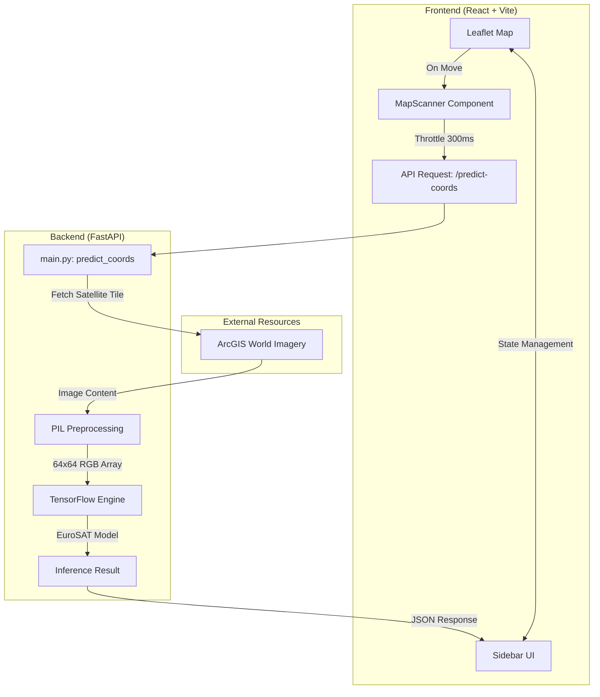

# Terrain AI - Real-time Satellite Imagery Classifier


An AI-powered platform that analyzes real-time satellite imagery to classify terrain types across the globe. Using high-resolution imagery and Deep Learning, it provides instant insights into land cover and urban development.

---

## 📘 Table of Contents
- [Features](#-features)
- [System Architecture](#-system-architecture)
- [Workflow](#-workflow)
- [Tech Stack](#-tech-stack)
- [Installation](#-installation--usage)
- [Future Enhancements](#-future-enhancements)
- [LLM Prompts Used](#-llm-prompts-used-to-create-this-project)
- [Author](#-author)

---

## 🚀 Features
- **Real-time Map Scanner**: Automatically analyzes terrain as you pan across the world map.
- **AI Terrain Classification**: Detects 10 categories including Forest, Residential, Industrial, and Agricultural fields.
- **Interactive Dashboard**: Glassmorphic UI with dynamic animations and history tracking.
- **Precision Confidence Scoring**: Real-time probability breakdown for each terrain prediction.
- **Geolocation Support**: Instantly jump to your current location for local terrain analysis.

---

## 🏗️ System Architecture
> The system integrates a Leaflet-based frontend with a FastAPI backend. The backend fetches satellite tiles from ArcGIS/ESRI servers and processes them through a pre-trained EuroSAT model for sub-100ms inference.



---

## 🔄 Workflow
1. **Explore**: Pan or search the interactive map to any location worldwide.
2. **Scan**: The pulsing scanner fetches 64x64 resolution satellite tiles for the center point.
3. **Analyze**: The FastAPI backend processes the tile through the TensorFlow engine.
4. **Visualize**: Results are displayed with confidence bars and categorical history.

---

## 🛠️ Tech Stack
| Layer | Technology |
|--------|-------------|
| **Frontend** | React + Vite + Tailwind CSS |
| **Animations** | Framer Motion |
| **Maps** | Leaflet + OpenStreetMap |
| **Backend** | Python (FastAPI) |
| **AI/ML** | TensorFlow + EuroSAT Model |
| **Deployment**| Hugging Face Spaces (Docker) |

---

## 💻 Installation & Usage

### Local Development
```bash
git clone https://github.com/AryanEjantkar/Terrain-AI-.git
cd terrain-predictor

# Backend Setup
cd backend
pip install -r requirements.txt
python main.py

# Frontend Setup
cd ../frontend
npm install
npm run dev
```

---

## 🔮 Future Enhancements
- **TF.js Migration**: Move inference to the browser for zero-latency offline analysis.
- **Change Detection**: Compare historical satellite data to detect deforestation or urban sprawl.
- **Multi-Model Support**: Switch between specialized models for agriculture, forestry, or urban planning.
- **Global Search**: Enhanced location indexing for faster navigation.

---

## 🤖 LLM Prompts Used to Create This Project
This project was developed using Large Language Models (LLMs) to optimize system design, UI aesthetics, and inference logic.

---

### 1. Project Ideation
> "Create a high-performance terrain classification system that uses real-time satellite imagery and displays it on an interactive dashboard with a premium glassmorphic design."

---

### 2. UI/UX Design
> "Design a modern, left-aligned sidebar for a map-based application. Include glassmorphic tabs for Analysis, About, and Contact, with a pulsing scan effect in the center of the screen."

---

### 3. Backend Optimization
> "Write a FastAPI endpoint that takes GPS coordinates, fetches a satellite tile from ArcGIS, and runs it through a TensorFlow model. Optimize for speed using persistent requests sessions."

---

### 4. Animation Logic
> "Implement smooth state transitions for terrain prediction bars using Framer Motion, including a hover-sensitive history list for recently scanned locations."

---

## 👨‍💻 Author

**Aryan Vimal Ejantkar**
🎓 B.Tech (AIML) – VIT Bhopal
💼 Passionate about AI, ML, and automation

---
