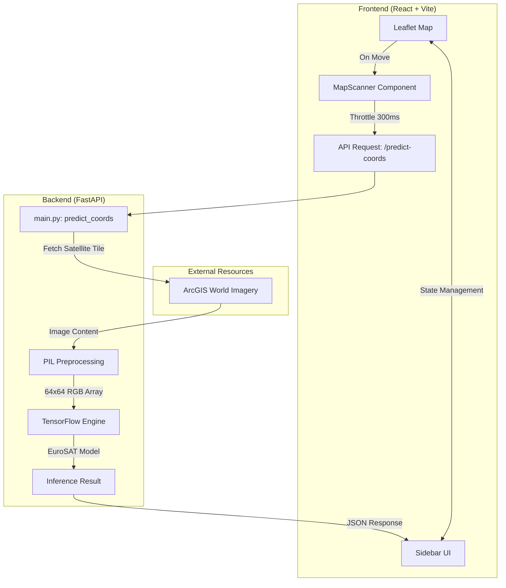

# Terrain AI - Real-time Satellite Imagery Classifier


## 🌍 About Terrain-AI

**Terrain-AI** is an AI-powered geospatial analysis platform that helps users understand and analyze terrain using satellite imagery and machine learning. The project combines modern AI techniques with an intuitive web interface to provide meaningful terrain insights for environmental monitoring, land assessment, and decision-making.

The platform processes terrain data to identify geographical features, classify land characteristics, and generate visual insights that are easy to interpret. Designed with scalability and usability in mind, Terrain-AI demonstrates how artificial intelligence can simplify complex geospatial analysis for researchers, students, developers, and organizations.

### ✨ Key Highlights

* 🤖 AI-driven terrain analysis and prediction
* 🛰️ Satellite imagery and geospatial data processing
* 📊 Interactive visualization of terrain insights
* ⚡ Fast and responsive user interface
* 📈 Data-driven decision support for terrain evaluation
* 🔍 Automated feature extraction and classification
* 🌱 Potential applications in agriculture, disaster management, urban planning, environmental monitoring, and infrastructure development

### 🎯 Project Goal

The goal of Terrain-AI is to make terrain intelligence more accessible by combining machine learning with geospatial technologies. Instead of manually interpreting large amounts of terrain data, users can leverage AI to obtain faster, more accurate, and actionable insights.

This project showcases the practical integration of AI, data visualization, and modern web technologies to solve real-world geospatial challenges while maintaining an intuitive and user-friendly experience.


---

## 📘 Table of Contents
- [Features](#-features)
- [System Architecture](#-system-architecture)
- [Workflow](#-workflow)
- [Tech Stack](#-tech-stack)
- [Installation](#-installation--usage)
- [Future Enhancements](#-future-enhancements)
- [LLM Prompts Used](#-llm-prompts-used-to-create-this-project)
- [Deployment link](#-Deployment-link)
- [Author](#-author)

---

## 🚀 Features
- **Real-time Map Scanner**: Automatically analyzes terrain as you pan across the world map.
- **AI Terrain Classification**: Detects 10 categories including Forest, Residential, Industrial, and Agricultural fields.
- **Interactive Dashboard**: Glassmorphic UI with dynamic animations and history tracking.
- **Precision Confidence Scoring**: Real-time probability breakdown for each terrain prediction.
- **Geolocation Support**: Instantly jump to your current location for local terrain analysis.

---

## 🏗️ System Architecture
> The system integrates a Leaflet-based frontend with a FastAPI backend. The backend fetches satellite tiles from ArcGIS/ESRI servers and processes them through a pre-trained EuroSAT model for sub-100ms inference.



---

## 🔄 Workflow
1. **Explore**: Pan or search the interactive map to any location worldwide.
2. **Scan**: The pulsing scanner fetches 64x64 resolution satellite tiles for the center point.
3. **Analyze**: The FastAPI backend processes the tile through the TensorFlow engine.
4. **Visualize**: Results are displayed with confidence bars and categorical history.

---

## 🛠️ Tech Stack
| Layer | Technology |
|--------|-------------|
| **Frontend** | React + Vite + Tailwind CSS |
| **Animations** | Framer Motion |
| **Maps** | Leaflet + OpenStreetMap |
| **Backend** | Python (FastAPI) |
| **AI/ML** | TensorFlow + EuroSAT Model |
| **Deployment**| Hugging Face Spaces (Docker) |

---

## 💻 Installation & Usage

### Local Development
```bash
git clone https://github.com/AryanEjantkar/Terrain-AI-.git
cd terrain-predictor

# Backend Setup
cd backend
pip install -r requirements.txt
python main.py

# Frontend Setup
cd ../frontend
npm install
npm run dev
```

---

## 🔮 Future Enhancements
- **TF.js Migration**: Move inference to the browser for zero-latency offline analysis.
- **Change Detection**: Compare historical satellite data to detect deforestation or urban sprawl.
- **Multi-Model Support**: Switch between specialized models for agriculture, forestry, or urban planning.
- **Global Search**: Enhanced location indexing for faster navigation.

---


---
## Deployment link

https://huggingface.co/spaces/AryanYeager/Terrain-AI


---

## 👨‍💻 Author

**Aryan Vimal Ejantkar**
🎓 B.Tech (AIML) – VIT Bhopal
💼 Passionate about AI, ML, and automation

---
